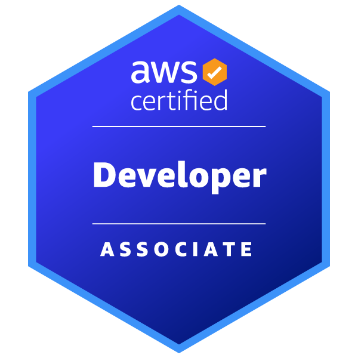
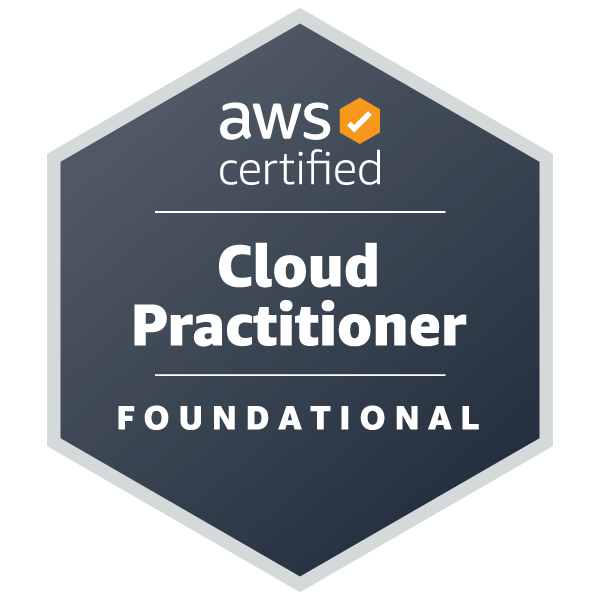
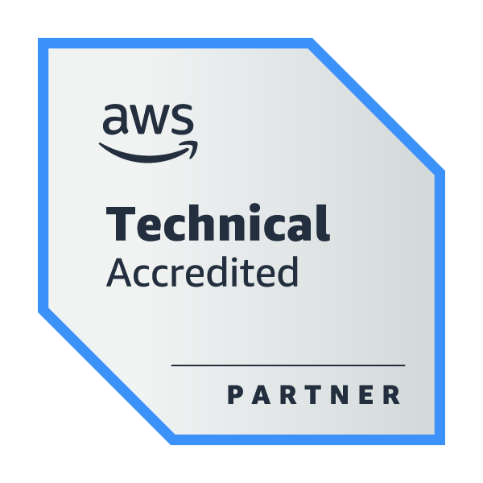

Hi 👋 My name is Daniyal Ibrahim
================================

DevOps Engineer & Software Developer
---

    I feel DevOps is just a funky modern term for a System Administrator 
    who automates infrastructure and configuration, usually in a 
    Hyperscaler Cloud environment. 

 

    Besides that, as a DevOps Engineer i have been mainly responsible for 
    deployment, documentation, testing in Google Cloud. Fortunately, i got the pioneer oppertunity to 
    work as Platform Administrator of a Google Cloud with Sovereign Controls.
    Wrote alot of yaml files for GitHub CI/CD, Kubernetes, Helm, Docker, Ansible etc.
    Deployed and Maintained Logging, Monitoring , Networking Resources. 

 

    I'm a graduate of B.Eng. Telematics from Technical University of Applied Sciences Wildau, Germany
    where I have learned to develop softwares using different programming languages i.e. go, python, java and typescript. 
    Nevertheless i learned about Algorithms & Datastructures, Robotics, Distributed Computation and Storage, Telecommunications, 
    Facility Automation and minor credit point modules of business and IT Law.

 

    

    DevOps by Profession
     
    Software Developer by Training
      
    and a Curiosity driven Tech Researcher by Choice
     

* 🧠  I'm always Eager to Grow and ready to Learn, Unlearn and ReLearn
* ⚡  On my journey to 10x growth!

### Job Experience
-----------------

*   since 08.2022, 🧑🏾‍💻 Working as a DevOps Engineer at [Capgemini](https://www.capgemini.com/de-de/) 
*  since 10.2020, 🧑🏾‍💻 Working as a [Freelance Software Developer at Fiverr](https://www.fiverr.com/notyouravgdev) 

### Eduacation
-----------------

* | 🏫  | 2018 - 2022 | Graduate of [B.Eng. Telematics](https://en.th-wildau.de/index.php?id=23510) at [Technical University of Applied Sciences](https://en.th-wildau.de/), Wildau, Brandenburg, Germany

* | 🏫  | 2016 - 2017 | Completed [ Foundation Year](https://en.th-wildau.de/study/programmes/wildau-foundation-year/overview/) at [Technical University of Applied Sciences](https://en.th-wildau.de/), Wildau, Brandenburg, Germany

* | 🏫  | 2011 - 2015 | Completed my Secondary and High School at [Military College Murree](https://www.mcm.edu.pk/mcm/), Murree, Punjab, Pakistan

### Bio Data
----------------- 
* 🌍  I've almost spend the last decade and still located here in Berlin, Germany   
* 🗺️ Born and raised in Pakistan 
* 🎂 Born in the 90s 

### Languages
-----------------
* Fluent in German 

* Fluent in English 

* Native Languages "Urdu & Punjabi"

### Contact Details
-----------------
* [My Resume (English & Deutsch) [pdf]](https://drive.google.com/drive/folders/1_Y-qn7KXACavy64cEP8D7HBXmUeSMK3I?usp=drive_link)
* [My Credly Profile](https://www.credly.com/users/daniyal-ibrahim/badges)
* ✉️ You can contact me via [email](mailto:daniyal.ibrahim10@gmail.com)
* 🌐 Or via Social Media:
 

    
    
    

### My Achievements - Credly Badges
----------------------------------------------------------------

### My Achievements - GitHub Badges
----------------------------------------------------------------

    
    
    
    

### My GitHub Stats
----------------------------------------------------------------

### My Software Development Skills
----------------------------------------------------------------

#### Frontend / UI Skills
----------------------------------------------------------------

#### Programming Languages Skills
----------------------------------------------------------------

#### Databases Skills
---------------------------------------------------------------

#### Cloud Technologies
----------------------------------------------------------------
* AWS Developer Associate
* AWS Cloud Practitioner

#### AI Development Skills
----------------------------------------------------------------

#### Others
----------------------------------------------------------------

